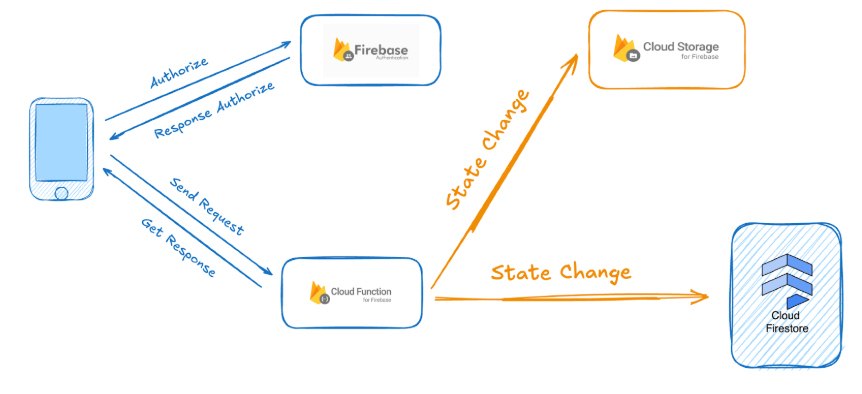
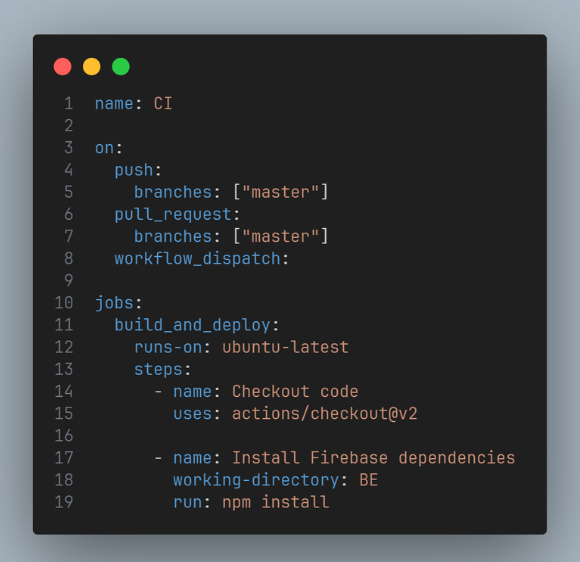
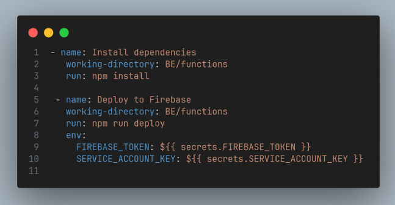
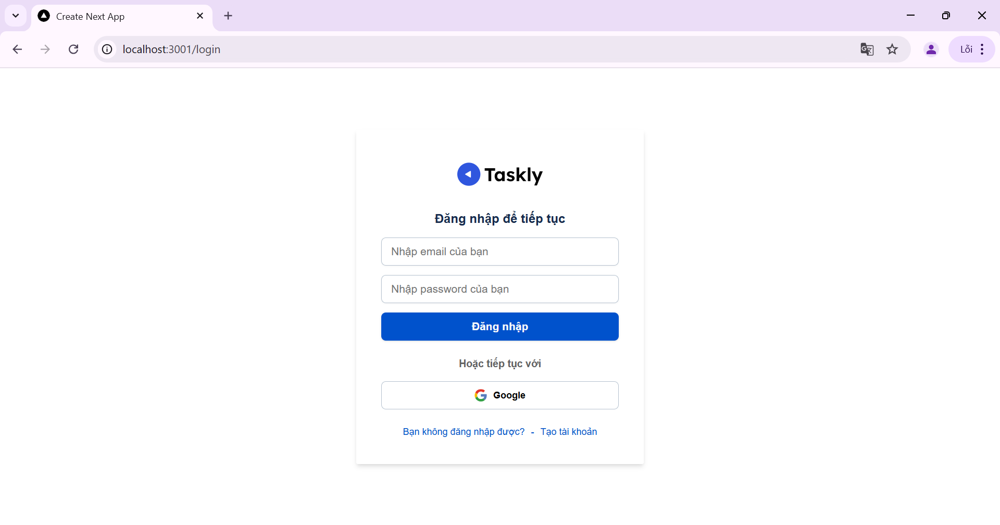
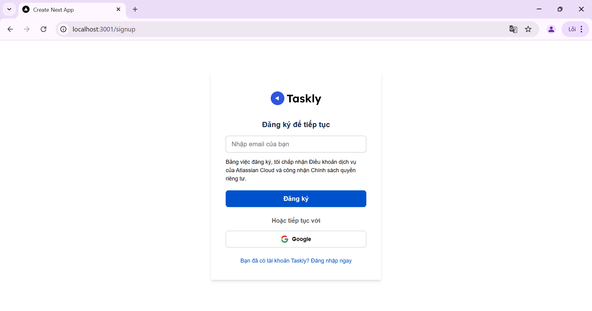
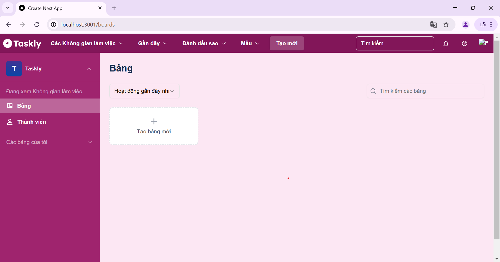
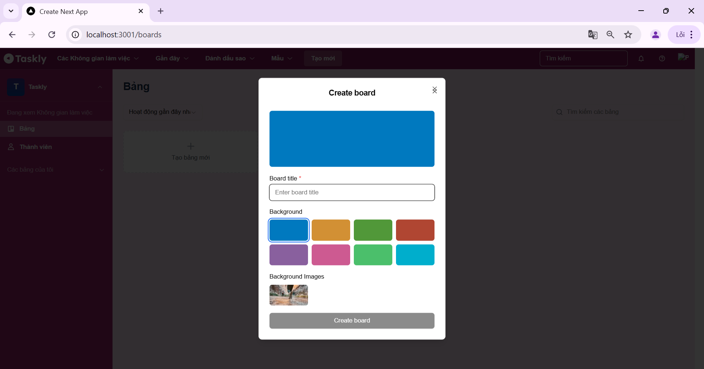
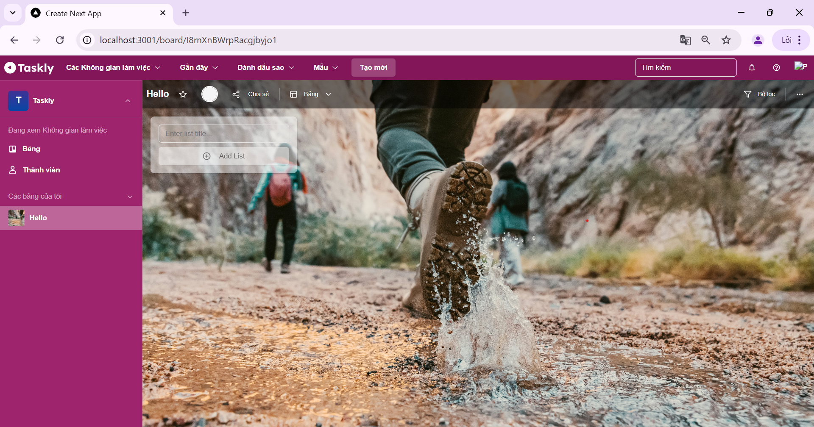
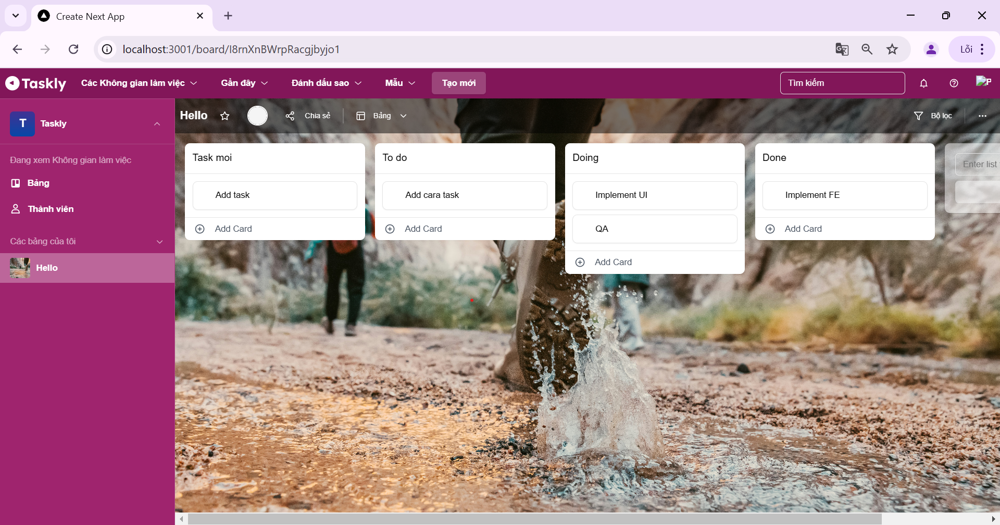
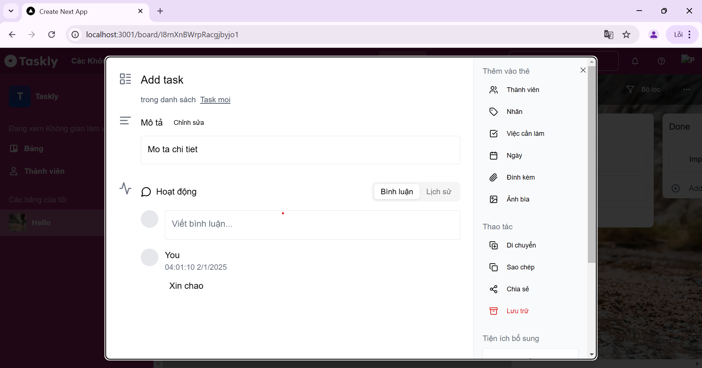

# Nghiên cứu và xây dựng ứng dụng quản lý công việc tích hợp Serverless Service

Việc nghiên cứu mô hình Serverless thông qua Firebase mang ý nghĩa quan trọng, đặc biệt trong bối cảnh nhu cầu xây dựng các ứng dụng hiện đại, hiệu quả và dễ bảo trì ngày càng tăng. Thông qua đề tài nghiên cứu này, nhóm chúng em sẽ không chỉ tìm hiểu lý thuyết về mô hình Serverless mà còn áp dụng thực tế bằng cách xây dựng một ứng dụng quản lý công việc dựa trên các dịch vụ của Firebase. Ứng dụng này sẽ giúp giải quyết bài toán về quản lý công việc, bao gồm tạo nhiệm vụ, phân công công việc, theo dõi tiến độ.

## 🌟 Các cơ sở lý thuyết

### Kiến trúc Serverless

Mặc dù tên gọi là serverless, điều này không có nghĩa là không có máy chủ để vận hành hệ thống. Thay vào đó, serverless đề cập đến việc các máy chủ đã được quản lý hoàn toàn bởi các nhà cung cấp dịch vụ đám mây hàng đầu như Google Cloud, AWS, và Azure. Các nhà cung cấp này xây dựng và duy trì cơ sở hạ tầng máy chủ, giúp người dùng chỉ cần tập trung vào việc triển khai ứng dụng hoặc chức năng mà không phải lo lắng về việc quản lý hoặc thiết lập hạ tầng.



### So sánh Serverless và Micro-service

Microservice và serverless đều có điểm chung là các thành phần hoạt động độc lập: trong microservice, các service không ảnh hưởng lẫn nhau khi gặp sự cố, tương tự, các function trong serverless cũng triển khai và tồn tại riêng lẻ.

### So sánh Serverless và Container Architecture

Cả serverless architecture và container architecture đều cho phép các nhà phát triển deploy ứng dụng bằng cách trừu tượng hóa môi trường máy chủ, nhưng giữa chúng có những điểm khác biệt. Khi sử dụng container architecture thì lập trình viên phải update lại từng container khi có sự thay đổi còn với serverless thì việc đó được tự động xử lí dựa trên môi trường cloud computing của chính nó

## 🛠️ Nguyên lý hoạt động

### Tạo và deploy Firebase Function

- Bước 1: Tạo Project Firebase CLI

- Bước 2: Viết 1 function trong Firebase function

- Bước 3: Deploy function lên trên hệ thống server

- Bước 4: Kiểm tra function trên hệ thống

### Quy trình deploy


### Quản lý Firebase Function


### Cấu hình Function


### Container trong Firebase

Khi deploy một Firebase Function, source code sẽ
được đóng gói và lưu trữ trong môi trường của
Firebase.
Mỗi function được đóng gói vào một container riêng
biệt, đảm bảo tính cô lập và bảo mật.
Các dependencies (như thư viện, runtime, hoặc môi
trường cần thiết) cũng được bao gồm trong
container.

### Instance trong Firebase

Instance giống như 1 máy ảo chạy độc lập có các thông số tài nguyên CPU, RAM riêng biệt.
Được khởi tạo với một runtime riêng biệt
Không chia sẻ bộ nhớ, biến toàn cục, hoặc dữ liệu in-memory với các instance khác.

### Cơ chế hoạt động của Instance

- Khởi tạo instance: Nếu chưa có instance (hoặc sau một thời gian dài không sử dụng), Firebase sẽ khởi chạy một container mới từ image của function.
  Được gọi là "cold start" và thường mất thêm thời gian
  để khởi động

- Tái Sử Dụng Instance: Sau khi một instance được khởi tạo, Firebase có thể
  tái sử dụng nó để xử lý các yêu cầu tiếp theo nhằm
  tối ưu hóa tài nguyên và giảm thời gian phản hồi.
  Giảm thời gian khởi tạo khi dùng lại những instance
  cũ

- Tự Động Mở Rộng: Firebase Functions tự động mở rộng (scale-out) bằng
  cách tạo thêm các instance mới khi lưu lượng tăng
  cao, tuy nhiên nó chỉ tạo đến mức tối đa được setup
  trong options.
  Khi 1 instance không thể xử lí thêm request thì
  Firebase sẽ cung cấp thêm 1 instance mới

- Tự động thu hẹp: Khi lưu lượng giảm, Firebase sẽ tự động thu hẹp số
  lượng instance (scale-in) để tiết kiệm tài nguyên
  Các instance không hoạt động trong một khoảng thời
  gian (khoảng 15 phút) sẽ bị xóa.
  Giúp tối ưu hóa chi phí vì bạn chỉ trả tiền cho tài
  nguyên được sử dụng.

### Tìm hiểu về Cold Start

Cold start là hiện tượng xảy ra khi một hàm
serverless được khởi chạy lần đầu tiên hoặc sau một
khoảng thời gian không hoạt động.
Trong giai đoạn này, môi trường thực thi (runtime
environment) cần được khởi tạo, dẫn đến thời gian
phản hồi lâu hơn so với các lần gọi hàm sau đó
(warm invocation).

### Tìm hiểu về Cold StartCơ Chế Mở Rộng Của Firebase Functions Khi Quá Tải


### Development ToolsCI/CD trong Firebase Function với Git Action




## 🚀 Demo ứng dụng

### Yêu cầu chuẩn bị

- Node.js 18 (Latest LTS version)

- Visual Studio 2022/VS Code

### Các bước cài đặt

1. Clone repository

```bash

git clone (https://github.com/leesoonduck3009/seminar-cnpm)

cd FE

```

2. Cài đặt frontend dependencies

```bash

cd FE

npm install

```

3. Cài đặt backend dependencies

```bash

cd ../BE

npm install

```

Local host ứng dụng `http://localhost:3000` (frontend)

## 📝 Ứng dụng

1. Đăng nhập / Đăng ký




2. List Board



3. Create Board



4. Detail Board



5. List Card



6. View Detail Card



## 🌟 Giảng viên hướng dẫn

ThS. Đinh Nguyễn Anh Dũng

## 🤝 Thành viên

1. Trần Thanh Hiền

2. Nguyên Phúc Bình
